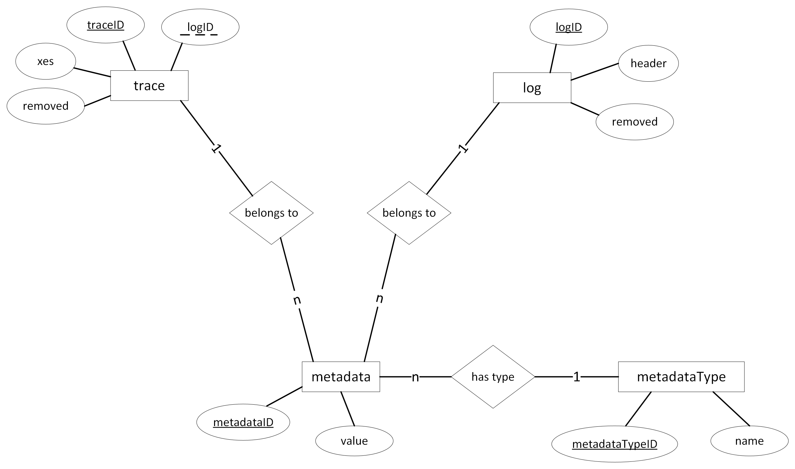

# MySQL Database - Documentation

The main purpose of the database is to store XES logs and the
traces they contain. Another purpose is to store metadata
belonging to a log or trace.

Take a look at the following SQL document:

 ````SQL
DROP TABLE IF EXISTS trace;
DROP TABLE IF EXISTS log;
DROP TABLE IF EXISTS metadata;
DROP TABLE IF EXISTS metadataType;
DROP TABLE IF EXISTS metadata_belongsTo_trace;
DROP TABLE IF EXISTS metadata_belongsTo_log;
DROP TABLE IF EXISTS metadata_hasType;


CREATE TABLE log (
    logID VARCHAR(36) NOT NULL,
    header MEDIUMTEXT NOT NULL,
    removed BOOLEAN DEFAULT FALSE,
    PRIMARY KEY (logID)
);

CREATE TABLE trace (
    traceID VARCHAR(36) NOT NULL,
    logID VARCHAR(36) REFERENCES log.logID,
    xes MEDIUMTEXT NOT NULL,
    removed BOOLEAN DEFAULT FALSE,
    PRIMARY KEY (traceID)
);

CREATE TABLE metadata (
    metadataID int NOT NULL AUTO_INCREMENT,
    value TEXT NOT NULL,
    PRIMARY KEY (metadataID)
);

CREATE TABLE metadataType (
    metadataTypeID int NOT NULL AUTO_INCREMENT,
    name TEXT NOT NULL,
    PRIMARY KEY (metadataTypeID)
);

CREATE TABLE metadata_belongsTo_log (
    metadataID int NOT NULL REFERENCES metadata.metadataID,
    logID VARCHAR(36) NOT NULL REFERENCES log.logID
);

CREATE TABLE metadata_belongsTo_trace (
    metadataID int NOT NULL REFERENCES metadata.metadataID,
    traceID VARCHAR(36) NOT NULL REFERENCES trace.traceID
);

CREATE TABLE metadata_hasType (
    metadataID int NOT NULL REFERENCES metadata.metadataID,
    metadataTypeID int NOT NULL REFERENCES metadataType.metadataTypeID
);
 ````

This document (re-)initializes the database. As you can see there
are seven tables:
* `log`
* `trace`
* `metadata`
* `metadataType`
* `metadata_belongsTo_log`
* `metadata_belongsTo_trace`
* `metadata_hasType`

The first four tables represent entities and the other three
represent relationships between the metadata entity and the
other entities respectively.



Since `log.lodID` and `trace.traceID` should be UUIDs, they are
of type VARCHAR(36). They are the primary keys of log and trace
respectively. The UUID has to be provided by the user in the
INSERT statement. `metadata.metadataID` however is an
autoincrementing integer which has not to be provided by the
user when creating a metadata entry.

The value of `log.header` of a log entry should always be the
valid XES document of the log but __without__ the trace
elements. The trace elements would then be the values of
`trace.xes` belonging to their entries in the trace table.

#### Example

Complete log:
```XML
<?xml version="1.0" encoding="utf-8" ?>
<log logAttribute="extra">
    <extension name="e1" prefix="e1" uri="uri"/>
    <trace>
        <string value="v1" key="s1">
            <boolean value="true" key="b1"></boolean>
        </string>
        <event>
            <list key="l1">
                <container key="c1">
                    <string value="lol" key="s2"></string>
                    <float value="3.5" key="f1"></float>
                    <float value="3.5" key="f1"></float>
                    <string value="3.5" key="f1"></string>
                </container>
            </list>
        </event>
        <boolean value="false" key="b2"></boolean>
    </trace>
    <global scope="event">
        <id value="none" key="id1"></id>
    </global>
    <trace>
        <event></event>
        <event></event>
    </trace>
    <classifier name="class1" keys="c1"/>
    <global scope="trace">
        <list key="list0"><list key="list1"><list key="list1"></list></list></list>
    </global>
    <string value="string" key="s4"></string>
    <float value="42" key="f2"></float>
</log>
```

`log.header`:
```XML
<?xml version="1.0" encoding="utf-8" ?>
<log logAttribute="extra">
    <extension name="e1" prefix="e1" uri="uri"/>
    
    <global scope="event">
        <id value="none" key="id1"></id>
    </global>
    
    <classifier name="class1" keys="c1"/>
    <global scope="trace">
        <list key="list0"><list key="list1"><list key="list1"></list></list></list>
    </global>
    <string value="string" key="s4"></string>
    <float value="42" key="f2"></float>
</log>
```

First `trace.xes`:
```XML
<trace>
    <string value="v1" key="s1">
        <boolean value="true" key="b1"></boolean>
    </string>
    <event>
        <list key="l1">
            <container key="c1">
                <string value="lol" key="s2"></string>
                <float value="3.5" key="f1"></float>
                <float value="3.5" key="f1"></float>
                <string value="3.5" key="f1"></string>
            </container>
        </list>
    </event>
    <boolean value="false" key="b2"></boolean>
</trace>
```

Second `trace.xes`:
```XML
<trace>
    <event></event>
    <event></event>
</trace>
```

Also, `trace.logID` should equal `log.logID` if the trace
originally belonged to the respective log.

All these constraints are not checked by the database but
implemented by the REST API.